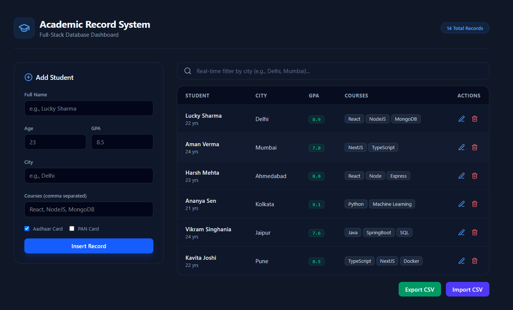

# 🎓 Student Record Management System (Full-Stack MERN)


> A high-performance, decoupled full-stack MERN application engineered to manage student academic records, calculate dynamic GPA analytics, stream bulk CSV datasets, and execute multi-variable queries against MongoDB Atlas.

---

## 🖼️ Application Preview

<p align="center">
  
</p>

---

## ✨ Key Features

* **Full CRUD Lifecycle**: Create, read, update (`PATCH`), and delete student records with instant UI state synchronizations.
* **Bulk CSV Import (Streaming)**: Stream and parse multi-row CSV files directly from memory buffers using `multer` and `csv-parser` without writing temporary files to disk.
* **Bulk CSV Export (Cache-Busted)**: Convert live MongoDB collection records into standard `.csv` files using `json2csv` with dynamic headers preventing HTTP 304 caching.
* **Advanced Multi-Field Search & Filter**: Real-time debounced query filters across student names, cities, minimum/maximum GPA thresholds, and enrolled course tags.
* **Server-Side Pagination & Sorting**: High-performance data slicing using MongoDB `.skip()`, `.limit()`, and dynamic index-based sorting (`asc`/`desc`).
* **Real-Time Aggregation Analytics**: Live calculation of total enrolled students, average GPA, minimum/maximum scores, and city distributions using the MongoDB Aggregation Pipeline (`$group`, `$avg`, `$min`, `$max`).
* **Resilient Cloud Persistence**: Built on MongoDB Atlas with custom DNS server overrides (`dns.setServers`) to eliminate local router/ISP SRV record resolution drops (`querySrv ECONNREFUSED`).
* **Nested Schema Modeling**: Structured schema handling dynamic course string arrays (`courses: [String]`) and boolean ID card objects (`hasPenCard`, `hasAdhaarCard`).
* **Responsive Dashboard UI**: Fully responsive, accessible data tables and modal forms styled with Tailwind CSS.

---

## 🏗️ Architecture & Tech Stack

### Frontend (`client/`)
* **Framework**: React 18 (Vite build engine)
* **Styling**: Tailwind CSS (Utility-First Responsive UI)
* **State & Networking**: Native Fetch API with `FormData` multi-part stream handling and optimistic UI updates

### Backend (`server/`)
* **Runtime**: Node.js (ES Modules)
* **API Engine**: Express.js REST API
* **Database & ODM**: MongoDB Atlas & Mongoose
* **Streaming & Data Parsers**: `multer` (MemoryStorage), `csv-parser`, `json2csv`
* **DNS Resolver**: Node.js native `dns` module with Google Public DNS routing (`8.8.8.8`, `8.8.4.4`)

---

## 📂 Project Structure

```text
student-record-system/
├── client/                      # Frontend React application
│   ├── public/
│   │   └── image.png            # Dashboard banner/preview asset
│   ├── src/
│   │   ├── api/                 # API client utilities (studentApi.js)
│   │   ├── components/          # React components (CsvActions.jsx, AnalyticsCards.jsx, FilterBar.jsx, StudentTable.jsx)
│   │   ├── App.jsx              # Main dashboard container & state logic
│   │   └── main.jsx
│   ├── package.json
│   └── vite.config.js
│
├── server/                      # Backend Express REST API
│   ├── src/
│   │   ├── config/              # MongoDB Atlas connection & DNS override (db.js)
│   │   ├── controllers/         # Request logic, aggregations & CSV streaming (studentController.js)
│   │   ├── models/              # Mongoose Data Models (Student.js)
│   │   └── server.js            # Express app entry & route definitions
│   ├── .env.example             # Template for environment variables
│   └── package.json
│
├── .gitignore                   # Root ignore rules for node_modules, system files, and secrets
└── README.md